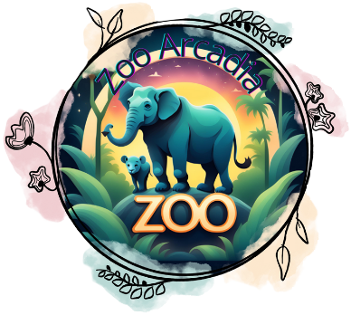

### Zoo Arcadia ### 
-------------------

**Lisez-moi**
=============

Ce site est un site vitrine pour le Zoo Arcadia
Crée dans le cadre de ma formation dans l'école Studi pour mon ECF 
------------------------------------------------------------------

### Présentation ###
--------------------

Ce site est un site vitrine pour le Zoo Arcadia
Crée dans le cadre de ma formation dans l'école Studi pour mon ECF 
------------------------------------------------------------------

### Technologie utilisées ###
-----------------------------

* **HTML5** ===============> structure du site
* **SCSS** ================> style du site
* **JAVASCRIPT** ==========> ajout des fonctions de connexion (en attente de passage sur php)
* **BOOTSTRAP 4.5.2** =====> création des carrousels, et des navbars
* **FONT AWESOME 5.15.1** => ajout d'icônes
* **googleapis** ==========> ajout d'icones et de police de caractères 
* **VS CODE** =============> éditeur du code
* **MY SQL** ==============> système de gestion de base de données
* **PHPMYADMIN** ==========> outil de gestion de base de données
* **XAMPP** ===============> environnement

### Fonctions ###
-----------------

### FrontEnd ###
----------------
* **Page d'accueil** : Acueil/présentation du zoo
* **Page services**  : présentation des services du zoo
* **Page Habitats** : page de présentation des differents habitats
* **Page Marais** : habitat des marais 
* **Page Jungle** : habitat de la jungle
* **Page Savane** : habitat de la savane
* **Page les differents annimaux** : présentation des annimaux du zoo
* **Page Contact** : contact par mail du zoo
* **Page Avis** : visiteurs laissant leurs avis
* **Page Connexion/deconnexion** 
* **Page Administrateur** : réservée a l'administrateur
* **Page Vétérianire** : reservée aux vétérinaires
* **Page Employe** : réservée aux employés

### BackEnd ###
---------------

* **le backend** : sera mis en place plus tard (manque de temps) 
-------------------------------------------------------------------------

### Installation ###
--------------------

**1**
Télécharge et extraite le fichier sur le site GITHUB adresse : https://github.com/Katniss40/Arcadia3

**2**
Ouvrir le projet dans vsCode : FIchier index.html en  mode PHPSERVER, vous tomberez sur la page "404 - page introuvable".
Il suffira de clique sur Accueil et vous pourrez acceder au site

===========================================================================================================================

Je vous souhaite une bonne navigation

Bourdeloux Corinne
